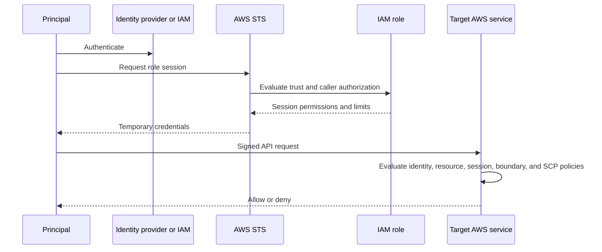

# AWS Security Token Service

## Overview

AWS Security Token Service issues temporary security credentials for role assumption, federation, and session operations. The credentials expire and carry a session token, reducing the risk and management burden of permanent credentials.

## Exam Alignment

- **Primary SCS-C03 Domain:** Identity and Access Management
- **Secondary Domain(s):** Security Foundations and Governance
- **Main AWS Services:** AWS STS, AWS IAM
- **Lesson Type:** Architecture
- **Exam Importance:** High
- **Core Skill:** Choose the correct STS operation and reason about temporary-session permissions.

## Core Concepts

- AssumeRole is used for IAM roles and cross-account delegation; AssumeRoleWithSAML and AssumeRoleWithWebIdentity accept federation assertions or tokens.
- GetSessionToken is commonly associated with MFA-protected temporary credentials for an IAM user; GetFederationToken creates a federated user session.
- Regional STS endpoints improve resiliency and can reduce latency; do not hard-code assumptions about one global endpoint.
- Session policies and role permissions intersect, and session tags can carry attributes for attribute-based access control.

## How It Works

1. The caller authenticates to an STS endpoint and submits the operation-specific proof.
2. STS evaluates caller permission and the role trust policy where applicable.
3. STS returns an access key ID, secret access key, session token, and expiration.
4. The target service evaluates every signed request against the temporary session context.

## Architecture and Service Relationships

A principal authenticates, AWS builds the request context, and the authorization engine evaluates every applicable policy before the target service permits or denies the operation.

## Policy or Permission Analysis

Identify the policy type and scope first, then evaluate Effect, Action or NotAction, Resource or NotResource, Principal where valid, and Condition. Confirm that the action supports resource-level permissions and that each Amazon Resource Name (ARN) has the correct form.

Authorization starts with an implicit deny. An applicable allow is required, and any applicable explicit deny overrides it. Service control policies, permissions boundaries, and session policies limit permissions; they do not grant permissions. A role trust policy controls who may assume a role, while its permissions policies control what the resulting session may do. Resource policies and AWS KMS key policies must be evaluated with their service-specific and cross-account rules.

## Detection, Logging, and Evidence

AWS CloudTrail management events provide evidence for IAM and AWS Security Token Service (AWS STS) API activity. When data-plane evidence is required, explicitly enable the applicable service logging because management-event history alone is not a complete activity record.

## Troubleshooting

| Symptom | Likely Cause | Verification | Resolution |
| --- | --- | --- | --- |
| AccessDenied | No applicable allow, an explicit deny, or a mismatched action/resource/condition | Inspect all policy layers and the CloudTrail event context | Correct the governing policy while preserving least privilege |
| Expected access is broader than intended | Wildcard scope, missing condition, or unintended resource-policy grant | Use IAM Access Analyzer and test representative requests | Narrow actions, resources, principals, and conditions |

## Security Best Practices

- Prefer temporary credentials and roles over long-term access keys.
- Grant least privilege and add conditions that are dependable for the request path.
- Record relevant API activity and periodically review unused or external access.

## Pitfalls and Misconfigurations

- An allow in one policy does not defeat an applicable explicit deny in another.
- A permissions boundary or service control policy limits permissions but never grants them by itself.

## Exam Decision Guide

| Requirement or Clue | Most Likely Service or Control | Why |
| --- | --- | --- |
| Workload needs AWS permissions without stored keys | IAM role | Provides automatically rotated temporary credentials. |
| Need to determine why a request failed | Policy evaluation plus CloudTrail | Reconstructs the request context and all applicable guardrails. |

## Common Exam Traps

- Do not evaluate a policy document in isolation when service control policies, resource policies, boundaries, session policies, or service-specific rules also apply.
- Authentication establishes an identity; authorization still requires all applicable policies to permit the requested action.

## Memory Hooks

### One-Line Memory Hook

> **STS lends expiring credentials; IAM policies decide what the loan can buy.**

### Mental Model

Think of authorization as intersecting gates: the request succeeds only when a grant is present and no applicable gate contributes an explicit deny.

## Key Terms and Definitions

| Term | Definition | Exam Relevance |
| --- | --- | --- |
| Principal | Identity making or delegating a request | Locate who is authenticated and authorized. |
| Explicit deny | A matching Deny statement that overrides allows | Highest-priority authorization outcome. |
| Request context | Attributes AWS uses to evaluate conditions | Explains conditional access decisions. |

## Quick Review

- AssumeRole is used for IAM roles and cross-account delegation; AssumeRoleWithSAML and AssumeRoleWithWebIdentity accept federation assertions or tokens.
- GetSessionToken is commonly associated with MFA-protected temporary credentials for an IAM user; GetFederationToken creates a federated user session.
- Regional STS endpoints improve resiliency and can reduce latency; do not hard-code assumptions about one global endpoint.
- Session policies and role permissions intersect, and session tags can carry attributes for attribute-based access control.
- Exam focus: Choose the correct STS operation and reason about temporary-session permissions.

## Self-Check Questions

1. What takes precedence when an allow and an applicable explicit deny overlap?

Answer

The explicit deny. An allow is effective only when no applicable explicit deny exists.

2. What evidence helps explain an IAM or STS API authorization failure?

Answer

The CloudTrail event plus the identity, resource, request attributes, and all applicable policy types.

3. Do permissions boundaries or service control policies grant permissions?

Answer

No. They define maximum available permissions; an applicable identity- or resource-based allow is still required.

## References

### Source References

- https://learn.cantrill.io/courses/1723753/lectures/39152939

### Current AWS References

- https://docs.aws.amazon.com/STS/latest/APIReference/welcome.html
- https://docs.aws.amazon.com/IAM/latest/UserGuide/id_credentials_temp.html

---

## Updated Information as of 2026-09-07

| Original or Older Information | Current Information | Reason for Update | Exam Impact |
| --- | --- | --- | --- |
| Older SCS-C02 domain labels | SCS-C03 domain alignment is based on lesson content | The current exam separates and renames domains | Use the current domain model when classifying scenarios. |
