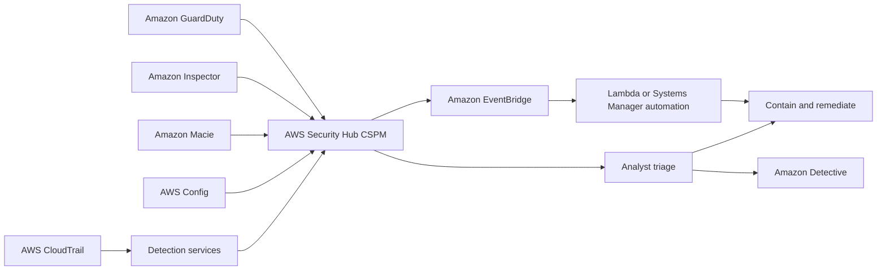

# AWS Security Hub CSPM

## Overview

AWS Security Hub Cloud Security Posture Management (CSPM) centralizes and normalizes security findings and evaluates resources against enabled security standards and controls. It improves visibility and prioritization but is not itself the underlying detector for every finding.

## Exam Alignment

- **Primary SCS-C03 Domain:** Detection
- **Secondary Domain(s):** Security Foundations and Governance
- **Main AWS Services:** AWS Security Hub CSPM, AWS Organizations, Amazon EventBridge
- **Lesson Type:** Concept
- **Exam Importance:** High
- **Core Skill:** Choose Security Hub CSPM for posture controls and centralized finding management.

## Core Concepts

- AWS Security Finding Format (ASFF) provides a common schema for findings from AWS services, integrations, and custom providers.
- Security standards run controls that generate control findings about resource posture.
- Organizations integration, delegated administration, and central configuration reduce multi-account and multi-Region drift.
- Automation rules can update and route findings; EventBridge integrations can trigger workflows, but aggregation alone is not remediation.

## How It Works

1. Enable Security Hub CSPM in required Regions and configure a delegated administrator and central policies where appropriate.
2. Enable relevant standards and integrations and allow findings to normalize into ASFF.
3. Aggregate findings into the chosen home Region when centralized operations require it.
4. Use automation rules, severity, workflow status, and resource context to prioritize triage.
5. Send actionable events to ticketing, Security Orchestration Automation and Response, or remediation runbooks.

## Architecture and Service Relationships

Security telemetry or an incident signal enters the detection workflow. Analysts preserve evidence, establish scope and timeline, contain affected identities or resources, eradicate the cause, and recover while retaining an auditable record.

## Policy or Permission Analysis

Authorization remains active during incident handling. Containment commonly uses an explicit deny or removal of permissions; the responder must account for identity policies, resource policies, session policies, permissions boundaries, and organization guardrails.

Authorization starts with an implicit deny. An applicable allow is required, and any applicable explicit deny overrides it. Service control policies, permissions boundaries, and session policies limit permissions; they do not grant permissions. A role trust policy controls who may assume a role, while its permissions policies control what the resulting session may do. Resource policies and AWS KMS key policies must be evaluated with their service-specific and cross-account rules.

## Detection, Logging, and Evidence

Use AWS CloudTrail for API activity and preserve relevant findings and service logs in a protected investigation account or evidence store. A finding is an investigative lead, not proof by itself; correlate principal, source, resource, timestamp, and subsequent activity before deciding scope.

## Troubleshooting

| Symptom | Likely Cause | Verification | Resolution |
| --- | --- | --- | --- |
| AccessDenied | No applicable allow, an explicit deny, or a mismatched action/resource/condition | Inspect all policy layers and the CloudTrail event context | Correct the governing policy while preserving least privilege |
| Expected access is broader than intended | Wildcard scope, missing condition, or unintended resource-policy grant | Use IAM Access Analyzer and test representative requests | Narrow actions, resources, principals, and conditions |

## Security Best Practices

- Enable services centrally across required accounts and Regions where organization features support it.
- Route high-value findings to an owned triage and response process with tested runbooks.
- Preserve original evidence, use least-privilege responder roles, and document containment decisions.

## Pitfalls and Misconfigurations

- Detection does not automatically contain a threat unless an explicit automation or response workflow is configured.
- Disabling one credential may not close resource-policy grants, other sessions, persistence mechanisms, or activity in another Region.

## Exam Decision Guide

| Requirement or Clue | Most Likely Service or Control | Why |
| --- | --- | --- |
| Need managed suspicious-activity detection | Amazon GuardDuty | Analyzes supported telemetry and protection-plan data. |
| Need to centralize and prioritize findings | AWS Security Hub CSPM | Normalizes findings and evaluates security controls. |
| Need relationship-based investigation | Amazon Detective | Builds investigation context around entities and activity. |

## Common Exam Traps

- Do not confuse the service that detects or aggregates a finding with the EventBridge, Systems Manager, Lambda, or human workflow that performs containment.
- Authentication establishes an identity; authorization still requires all applicable policies to permit the requested action.

## Memory Hooks

### One-Line Memory Hook

> **GuardDuty detects; Security Hub CSPM aggregates and checks posture.**

### Mental Model

Treat a finding like a smoke alarm: it starts triage, evidence collection, scope analysis, and response; it is not the fire suppression system.

## Key Terms and Definitions

| Term | Definition | Exam Relevance |
| --- | --- | --- |
| Finding | Structured report of a potential issue | Requires triage and prioritization. |
| Containment | Action that limits incident spread or attacker capability | Must balance speed, evidence, and business impact. |
| Evidence | Preserved data used to reconstruct and support conclusions | Integrity and access control matter. |

## Quick Review

- AWS Security Finding Format (ASFF) provides a common schema for findings from AWS services, integrations, and custom providers.
- Security standards run controls that generate control findings about resource posture.
- Organizations integration, delegated administration, and central configuration reduce multi-account and multi-Region drift.
- Automation rules can update and route findings; EventBridge integrations can trigger workflows, but aggregation alone is not remediation.
- Exam focus: Choose Security Hub CSPM for posture controls and centralized finding management.

## Self-Check Questions

1. Does enabling a detection service automatically remediate every finding?

Answer

No. Findings require an attached automation, runbook, or human response process unless the service explicitly performs a preventive action.

2. Which record is central when investigating AWS API activity?

Answer

AWS CloudTrail. Correlate its event identity and request fields with service logs and findings.

3. Why should incident responders preserve evidence before destructive containment when feasible?

Answer

Preserved evidence supports scoping, root-cause analysis, audit, and recovery validation. Urgent containment can still take priority when harm is continuing.

## References

### Source References

- https://learn.cantrill.io/courses/1723753/lectures/39076947~https://docs.aws.amazon.com/securityhub/latest/userguide/securityhub-findings-providers.html

### Current AWS References

- https://docs.aws.amazon.com/securityhub/latest/userguide/what-is-securityhub.html
- https://docs.aws.amazon.com/securityhub/latest/userguide/securityhub-findings-format.html

---

## Updated Information as of 2026-09-07

| Original or Older Information | Current Information | Reason for Update | Exam Impact |
| --- | --- | --- | --- |
| AWS Security Hub used as the product name | AWS documentation now uses AWS Security Hub CSPM for the posture-management capability | AWS distinguishes current Security Hub capabilities | Recognize CSPM terminology and keep aggregation separate from detection and response. |
