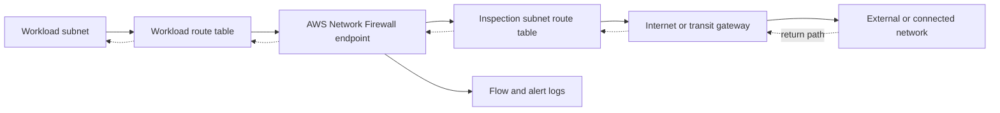

# AWS Network Firewall

## Overview

This lesson explains AWS Network Firewall as an infrastructure-security control. It converts the source lesson into the architecture, decision points, and failure modes most relevant to AWS Certified Security – Specialty (SCS-C03).

The central security objective is to create an intentional network or data path, apply controls at the correct layer, and retain enough evidence to distinguish routing, filtering, identity, encryption, and service-configuration failures.

## Exam Alignment

- **Primary SCS-C03 Domain:** Infrastructure Security
- **Secondary Domain(s):** Detection
- **Main AWS Services:** AWS Network Firewall, Amazon VPC
- **Lesson Type:** Architecture
- **Exam Importance:** High
- **Core Skill:** Explain, configure, and troubleshoot AWS Network Firewall without confusing reachability with authorization.

## Core Concepts

- AWS Network Firewall is a managed, stateful network firewall and intrusion prevention service deployed through firewall endpoints in dedicated subnets.
- VPC route tables must steer inspected traffic through the correct endpoint in both directions; asymmetric routing can bypass stateful inspection or break flows.
- Stateless rule groups inspect packets independently and can pass traffic to the stateful engine; stateful rules track flows and support domain or Suricata-compatible controls.
- Centralized inspection can use Transit Gateway architectures, AWS Firewall Manager policy, logging, and multiple Availability Zones.

## How It Works

1. AWS Network Firewall is a managed, stateful network firewall and intrusion prevention service deployed through firewall endpoints in dedicated subnets.
2. VPC route tables must steer inspected traffic through the correct endpoint in both directions; asymmetric routing can bypass stateful inspection or break flows.
3. Stateless rule groups inspect packets independently and can pass traffic to the stateful engine; stateful rules track flows and support domain or Suricata-compatible controls.
4. Centralized inspection can use Transit Gateway architectures, AWS Firewall Manager policy, logging, and multiple Availability Zones.

## Architecture and Service Relationships

```text
Initiating principal or workload
        |
        v
Network path / AWS Network Firewall
        |
        v
Policy and traffic controls
        |
        v
Target resource and security evidence
```



The route or service attachment establishes a possible path. Resource policies, identity policies, security groups, network ACLs, encryption controls, and application authorization remain independently enforceable where applicable.

## Detection, Logging, and Evidence

Enable AWS Network Firewall flow and alert logging to the supported destination required by the investigation. CloudTrail records firewall policy, rule-group, and endpoint configuration changes. VPC Flow Logs add connection metadata but do not identify which stateful signature matched, so correlate them with firewall alert logs and route tables.

## Troubleshooting

| Symptom | Likely Cause | Verification | Resolution |
| --- | --- | --- | --- |
| Traffic bypasses inspection | Route tables do not direct both directions through the firewall endpoint | Trace forward and return routes in every Availability Zone | Correct symmetric routing through the zonal endpoint |
| Expected traffic is dropped | Stateless default action, rule order, stateful rule, or HOME_NET scope is wrong | Review alert/flow logs and effective firewall policy | Correct the narrow rule or variable without broadly allowing traffic |
| No firewall logs appear | Logging is disabled, the destination policy is wrong, or traffic bypasses the endpoint | Inspect logging configuration, destination permissions, and routes | Enable the required log type and repair permissions or routing |
## Security Best Practices

- Apply least privilege to management and data-plane access for AWS Network Firewall, Amazon VPC.
- Prefer private paths and managed controls when they meet the requirement, but validate both routing and authorization.
- Design across Availability Zones where the service is zonal and the workload requires resilience.
- Log configuration changes and network behavior; alert on unauthorized or high-risk changes.
- Test an explicit denial path so an unnoticed public or uninspected fallback is not mistaken for success.

## Exam Decision Guide

| Requirement or Clue | Most Likely Control | Why |
| --- | --- | --- |
| Implement the exact capability taught here | AWS Network Firewall | It directly supplies the lesson's control point |
| Determine who changed the configuration | AWS CloudTrail | It records supported API activity and identity context |
| Determine whether IP traffic was accepted or rejected | VPC Flow Logs | It records flow metadata at supported VPC collection points |
| Enforce application-layer HTTP request rules | AWS WAF | It evaluates web requests rather than general VPC packet flows |

## Common Exam Traps

- Do not assume that creating AWS Network Firewall automatically updates routes, policies, DNS, or filters unless the service explicitly performs that integration.
- Network reachability is not IAM authorization, and an IAM allow cannot repair a missing route.
- Logging observes activity; it does not automatically prevent or remediate it.
- Regional, Availability Zone, and global scope matter. Place dependencies in the scope required by the service.
- Explicit deny overrides an applicable allow; default behavior is implicit deny where IAM authorization applies.

## Memory Hooks

### One-Line Memory Hook

> **A firewall only inspects traffic that routing actually sends through it.**

### Decision Memory Hook

> **No path? Check routes and DNS. Path but no packets? Check filters. Packets reach the service but fail? Check authorization and encryption dependencies.**

## Key Terms and Definitions

| Term | Definition | Exam Relevance |
| --- | --- | --- |
| AWS Network Firewall | AWS capability used in this lesson's security architecture. | Know its scope, control point, and nearest alternatives. |
| Amazon VPC | AWS capability used in this lesson's security architecture. | Know its scope, control point, and nearest alternatives. |
| Longest-prefix match | Routing selects the most specific matching destination prefix. | A specific service or network route can beat a default route. |

## Quick Review

- AWS Network Firewall is a managed, stateful network firewall and intrusion prevention service deployed through firewall endpoints in dedicated subnets.
- VPC route tables must steer inspected traffic through the correct endpoint in both directions; asymmetric routing can bypass stateful inspection or break flows.
- Stateless rule groups inspect packets independently and can pass traffic to the stateful engine; stateful rules track flows and support domain or Suricata-compatible controls.
- Centralized inspection can use Transit Gateway architectures, AWS Firewall Manager policy, logging, and multiple Availability Zones.
- A firewall only inspects traffic that routing actually sends through it.
- CloudTrail answers who changed configuration; VPC Flow Logs help diagnose IP flow acceptance and rejection.

## Self-Check Questions

1. What security problem does AWS Network Firewall solve?

<details>
<summary>Answer</summary>

It provides the control described by the lesson: aWS Network Firewall is a managed, stateful network firewall and intrusion prevention service deployed through firewall endpoints in dedicated subnets.

</details>

2. What is the most important exam distinction for this lesson?

<details>
<summary>Answer</summary>

A firewall only inspects traffic that routing actually sends through it. The surrounding route, policy, and filtering dependencies must also be evaluated.

</details>

3. A configured resource exists but the test still fails. What should be checked next?

<details>
<summary>Answer</summary>

Check DNS resolution, forward and return routes, security groups, network ACLs, applicable IAM/resource/key policies, service state, and logs. A resource's existence proves neither reachability nor authorization.

</details>

## References

### Source References

- https://learn.cantrill.io/courses/1723753/lectures/41669608

### Current AWS References

- https://docs.aws.amazon.com/network-firewall/latest/developerguide/what-is-aws-network-firewall.html

---

## Updated Information as of 2026-09-07

> No material technical updates were required for this lesson. Terminology and formatting were standardized for SCS-C03 study use.
