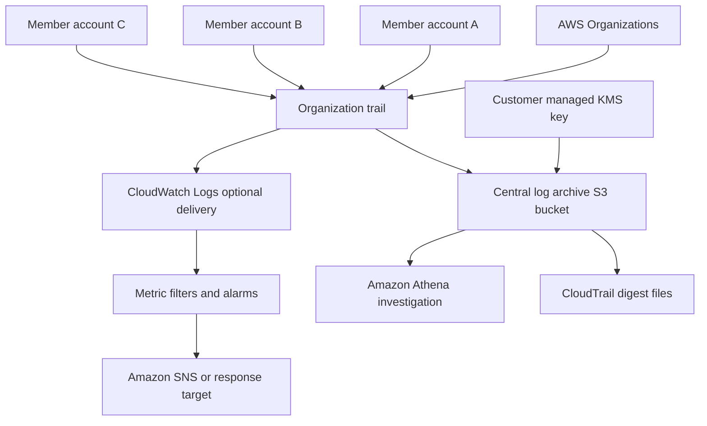

# Demonstration: Implementing an Organization Trail

## Overview

This demonstration creates a multi-Region AWS CloudTrail organization trail that records supported member-account activity into a centrally controlled Amazon S3 bucket and optionally CloudWatch Logs. Only the management account or delegated administrator can create or manage an organization trail.

## Exam Alignment

- **Primary SCS-C03 Domain:** Detection
- **Secondary Domain(s):** Security Foundations and Governance, Incident Response
- **Main AWS Services:** AWS CloudTrail, AWS Organizations, Amazon S3, CloudWatch Logs, AWS KMS
- **Lesson Type:** Demonstration
- **Exam Importance:** High
- **Core Skill:** Centralize organization-wide API evidence with protected storage and validated delivery.

## Demonstration Goal

Capture management events across organization accounts and Regions in a central archive and make selected events available for near-real-time monitoring.

## Prerequisites

- An organization with all features and CloudTrail trusted access.
- Management-account or delegated-administrator permissions.
- A dedicated log archive bucket with versioning, restrictive policy, encryption design, and lifecycle controls.
- A CloudWatch Logs group, KMS authorization, and CloudTrail delivery role if that integration is used.

## Architecture and Service Relationships

## Demonstration Steps

1. In the authorized administration account, create a trail and select **Enable for all accounts in my organization**.
2. Make the trail multi-Region and include global service events.
3. Select management-event coverage and deliberately configure required data or Insights events based on risk and cost.
4. Configure the central S3 bucket policy for CloudTrail delivery using scoped source conditions.
5. Enable log file validation and KMS encryption if customer-managed key control is required; authorize CloudTrail in the key policy.
6. Optionally deliver to CloudWatch Logs through the correct service role for metric filters and alarms.
7. Generate a benign member-account management event and verify delivery and searchable context.

## Validation

- Trail status shows logging in each required Region.
- A member-account event arrives under the correct S3 organization/account prefix.
- Digest files arrive when validation is enabled.
- CloudWatch Logs receives events if configured.
- Unauthorized member accounts cannot modify the organization trail.

## Troubleshooting

| Symptom | Likely Cause | Verification | Resolution |
| --- | --- | --- | --- |
| No member logs | Trusted access, organization setting, or bucket policy wrong | Inspect trail status and delivery errors | Correct organization/trail/bucket configuration |
| KMS error | Key policy lacks CloudTrail permissions or encryption context | Inspect trail error and key policy | Add narrowly scoped service authorization |
| CloudWatch empty | Delivery role or log-group permission wrong | Inspect trail integration status | Correct role and log-group settings |

## Cleanup

For a disposable lab only, disable or delete the trail after preserving any required evidence, then remove empty lab-only log groups/buckets and roles in dependency order. Never delete production audit evidence to save cost.

## What the Demonstration Proves

Organization trails provide centrally governed collection, while bucket, KMS, IAM, retention, and monitoring controls determine whether evidence is durable and useful.

## Quick Review

- Use multi-Region plus global service events.
- Select data events explicitly.
- Protect the archive outside workload control.
- Enable log file validation.
- Test with member-account evidence.

## Self-Check Questions

1. Why does a member account fail to edit an organization trail?

Answer

Organization trails are managed by the management account or registered delegated administrator, centralizing control.

## References

### Source References

- https://learn.cantrill.io/courses/1723753/lectures/39077053
- https://aws.amazon.com/cloudtrail/pricing/
- https://aws.amazon.com/cloudwatch/pricing/

### Current AWS References

- https://docs.aws.amazon.com/awscloudtrail/latest/userguide/creating-an-organizational-trail-in-the-console.html
- https://docs.aws.amazon.com/awscloudtrail/latest/userguide/cloudtrail-concepts.html

---

## Updated Information as of 2026-09-07

| Original or Older Information | Current Information | Reason for Update | Exam Impact |
| --- | --- | --- | --- |
| Demo notes referenced a 2023 console workflow | Workflow is described by durable configuration goals and includes delegated administration, advanced event selection, and current evidence protections | Console UI and CloudTrail capabilities evolve | Focus on architecture, policies, validation, and coverage rather than click positions |
